| [D2](imgs/d2.jpg)                             |
| <a href='imgs/d2.jpg'>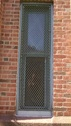</a> |

| [E1](imgs/e1.jpg)                             |
| <a href='imgs/e1.jpg'>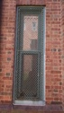</a> |

| [F1](imgs/f1.jpg)                             | [F2](imgs/f2.jpg)                             | [F3](imgs/f3.jpg)                             | [F4](imgs/f4.jpg)                             | [F5](imgs/f5.jpg)                             | [F6](imgs/f6.jpg)                             | [F7](imgs/f7.jpg)                             | [F8](imgs/f8.jpg)                             |
| <a href='imgs/f1.jpg'>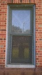</a> | <a href='imgs/f2.jpg'>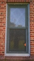</a> | <a href='imgs/f3.jpg'>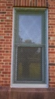</a> | <a href='imgs/f4.jpg'>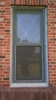</a> | <a href='imgs/f5.jpg'>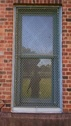</a> | <a href='imgs/f6.jpg'>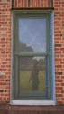</a> | <a href='imgs/f7.jpg'>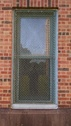</a> | <a href='imgs/f8.jpg'>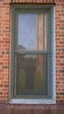</a> |

| [G1](imgs/g1.jpg)                             | [G2](imgs/g2.jpg)                             | [G3](imgs/g3.jpg)                             | [G4](imgs/g4.jpg)                             | [G5](imgs/g5.jpg)                             |
| <a href='imgs/g1.jpg'>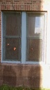</a> | <a href='imgs/g2.jpg'>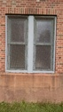</a> | <a href='imgs/g3.jpg'>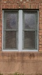</a> | <a href='imgs/g4.jpg'>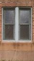</a> | <a href='imgs/g5.jpg'>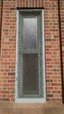</a> |
